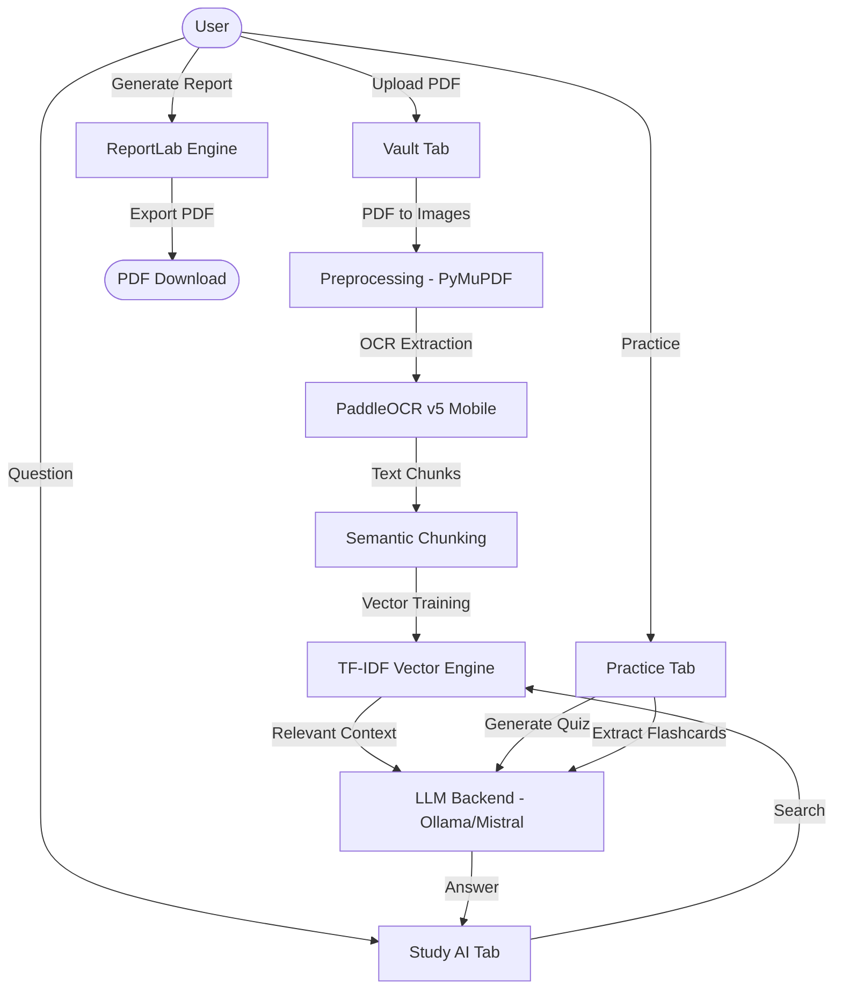

# 📝 NoteVault AI
### Professional Handwritten Notes Study Assistant — Gen AI Hackathon 2026

NoteVault AI is a high-performance, **privacy-first** personal study assistant. It transforms messy handwritten notes into an interactive, AI-powered knowledge base — operating entirely **offline**.

---

## 🏗 System Architecture & Flow



---

## 🌟 Core Innovations

### 🧠 Neural OCR Pipeline
Uses **PaddleOCR v5 Mobile** optimized for CPU efficiency. It identifies handwriting patterns and extracts text with spatial awareness, preserving the context of your original notes.

### 📐 Mathematical Vector Engine (Built from Scratch)
Unlike typical apps using external databases, NoteVault AI features a custom **TF-IDF Vectorizer** and **Cosine Similarity Matrix** built entirely in NumPy. This provides instant, accurate retrieval without any external dependencies.

### 💬 Deep Context RAG
Implements a sophisticated **Retrieval-Augmented Generation (RAG)** pipeline. It calculates a "Confidence Score" for every answer by analyzing vector distance and semantic alignment, ensuring the AI only speaks from your notes.

---

## 🛠 Technology Stack

| Layer | Technology |
|---|---|
| **Interface** | Streamlit (High-Impact Dashboard) |
| **Logic** | Python 3.12 |
| **OCR** | PaddleOCR (Deep Learning Mobile Models) |
| **Search** | Custom TF-IDF & NumPy Vector Math |
| **LLM** | Ollama (Mistral 7B / Llama 3) |
| **PDF Engine** | PyMuPDF (fitz) |
| **Reporting** | ReportLab |

---

## 📦 Getting Started

### 1. Install Dependencies
```bash
pip install -r requirements.txt
```

### 2. Configure Local LLM (Recommended)
Install [Ollama](https://ollama.com) and pull your preferred model:
```bash
ollama pull mistral
```

### 3. Launch NoteVault
```bash
streamlit run app.py
```

---

## 📝 How to Use
1. **Vault:** Upload your handwritten PDF. Watch the real-time processing pipeline analyze every stroke.
2. **Study AI:** Ask questions about specific formulas, dates, or concepts in your notes.
3. **Practice:** Generate instant Quizzes or Flashcards to test your retention.
4. **Session:** Export a professional summary of your entire study session.

---
*Developed for GenHack 2026*
